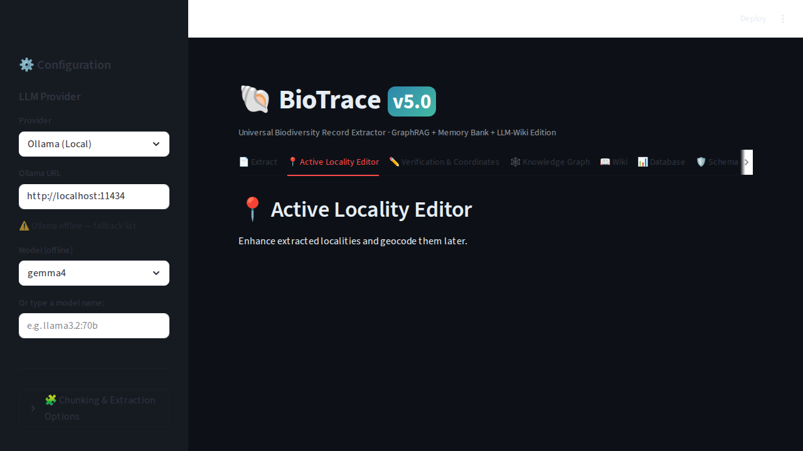
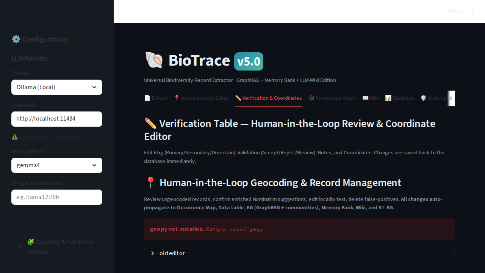

# HITL Interface

The Streamlit UI provides powerful active learning and data verification tools.

## Active Locality Editor
Here users can correct AI extractions of localities. These corrections are fed back into the **CAL system** to improve future prompt generations.

## Verification Table
The main verification table allows users to approve or reject whole records, edit coordinates, and see the exact **Raw Text Evidence** that led to the extraction.

